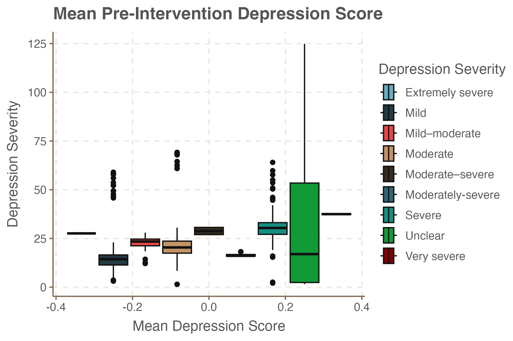

# An Analysis of Depression

Depression is defined as a mood disorder that is characterised by persistent feelings of sadness and hopelessness. According to the World Health Organisation, around 280 million people live with depression. It causes severe symptoms that affect how you feel, think, and handle daily activities. Many people who suffer from depression report disrupted sleep, lack of concentration, and thoughts of suicide. The cause of depression is complex and can be due to several psychological, biological, and social factors.

<p align="center">
  
  
</p>

# Purpose 
This repository contains R code that analyzes two datasets pertaining to depression. The first dataset was used to analyze which factors are influential in predicting depression, and the second dataset was used to analyze the effects of exercise as a treatment for depression.

<p align="center">
  
  
</p>

# Code and File Descriptions

There are two files that contain R code for the analysis. The R script called Depression_Analysis_Complete.R is the main file and contains all necessary calculations for the analysis. The second file is an R Markdown file called "An Analysis of Depression.Rmd", which contains the code to create the PDF for the academic poster. The second file is dependent on the main script Depression_Analysis_Complete.R.

### Depression_Analysis_Complete.R

*Beginning of Script One*

```r
# Script for analyzing depression
# Loading packages 
library(data.table) # Fread and data.table functionality
library(tidyverse) # Multiple packages including dplyr
library(kableExtra) # Output tables
library(caret) # Cross-validation
library(ggplot2) # Plots
library(ggthemr) # Theme of ggplots
library(rcompanion) # Cramer v test
library(randomForest) # Random forest model
library(pROC) # ROC plots
library(rcompanion)
library(DescTools)

# Function for applying chi-squared test
apply_chi_cramer = function(pairs,dt){
  # column_pairs : Names of categorical columns
  # dt: Data table that is passed
  
  # Getting the first and second categorical columns
  v1 = pairs[1]
  v2 = pairs[2]
  
  # Creating a table with frequencies
  tbl =  table(dt[[v1]],
               dt[[v2]])
  
```

### An Analysis of Depression.Rmd

*Beginning of Script 2*

```r
title: An Analysis of Depression
author:
  - name: Nicolas Siska
affiliation:
    address: School of Mathematics and Statistics
column_numbers: 4
logoright_name: UCDlogo.png
logoleft_name: UCDlogo.png
output: 
  posterdown::posterdown_html:
    self_contained: TRUE 
    css: mytheme.css 
poster_width: 84.1cm
poster_height: 118.9cm
bibliography: packages.bib
knit: pagedown::chrome_print
  
```

### Folders

* The folder called "data" contains the two datasets used in the analysis and saved models from the R script  Depression_Analysis_Complete.R.
* The images folder contains plots used in this README file.
*HTML and PDF folder contains the outputs of the "An Analysis of Depression.Rmd" script.
	
### CSS and BibTex Files

* mythem.css contains css code for the colors and size of the font for the academic poster.
* packages.bib is a bibliography file format used for managing references containing citation entries for various R packages.
 
 # Methodology of the Analysis
 In order to predict the response variable of the first dataset, three machine learning models were used: Random Forest, Logistic Regression, and Gradient Boosting. The following process was implemented.
 > Data Splitting
 
 The dataset was split into sixty-five percent training/validating data and thirty-five percent testing data.
 
 > Training/Hyperparameters Tuning
 
 Using the caret package the three models were trained on the training set, and the hyperparameters were tuned on the validation set.
 
 > Evaluation and Model Selection
 
 The following metrics were used to choose the best model.
 
 <p align="center">
  
</p>
 
 
In order to evaluate the effects of exercise as a treatment for depression the Kruskal-Wallis H was used to test the differences of the median change in depression scores between the control group and the exercise group. ANOVA was not applicable in this case sense the data did not follow a normal distribution.


 # Results of the Analysis
 
After a thorough analysis of the first dataset produced by the researches from Bangladesh, the top five most influential predictors on the response variable depression are: ANXI, POSSAT, ENVSAT, INFER, and DEPRI.

<p align="center">
  
</p>


*ANXI*: Whether a person recently feels anxiety.       
*POSSAT*: Whether a person is satisfied with their position or academic achievements.     
*ENVSAT*: Whether the participant is satisfied with their living environment or not.       
*INFER*: Whether a person suffers from inferiority complex.       
*DEPRI* : Whether a person feels that they have been deprived of something they deserve.       


These results were based on the coefficients of the Logistic Regression, the Pearson Chi-Squared Test of Independence, and the Cramer's V Measure. 

The Logistic Regression model performed the best in predicting depression. The tuned hyperparameters are 
- **alpha**: 0.2 (Elastic Net)
- **Lambda**: 0.04132012
- The performance of the Logistic Regression is shown in the metrics table.

<p align="center">
  
</p>

For the analysis of the effects of exercise on depression the results showed that there is a significant difference in the change of depression scores between exercise treatment and the control treatment used in the study. This is based on the non-parametric Kruskal-Wallis Test  and the Pairwise Wilcox Test.


<p align="center">
  
</p>

#### Pairwise Wilcox Test of Treatment Types

<p align="center">
  
</p>


 However from the results above there is no evidence to suggest that there is a significant difference in the effect of the exercise treatment compared to the other treatments of medication, therapy, and combined treatment.
A Generalized linear Model was used to examine various treatment effects on the difference between pre and post intervention depression scores. Several treatments demonstrate significant reduction in depression scores.  
-  **trtAerobic + ECT**: Estimate = -15.26, indicating a substantial decrease in depression severity.        
- **trtExercise + SSRI: baseline_severityMild–moderate**: Estimate = -16.66, suggesting a strong reduction in depression scores for individuals with mild to moderate baseline severity.          
- **trtStretching: baseline_severityMild–moderate**: Estimate = -10.38, indicating an improvement for individuals with mild to moderate baseline severity.
-  Treatments such as **trtExercise + SSRI** and **trtStretching** for individuals with baseline severity of mild to moderate show significant negative effects, indicating that they lead to the largest decreases in depression symptoms.


 
 